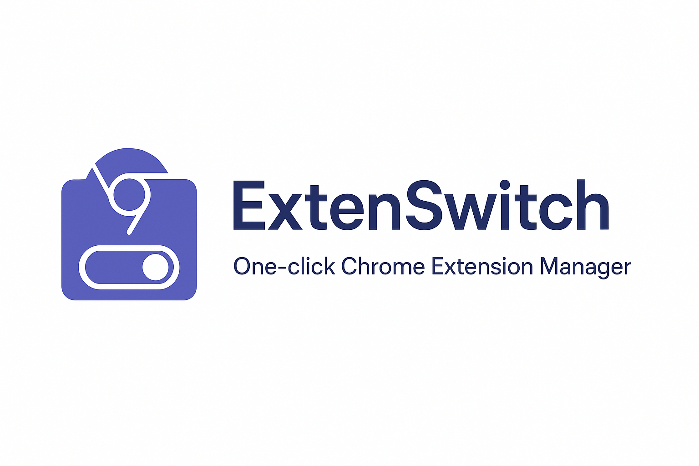
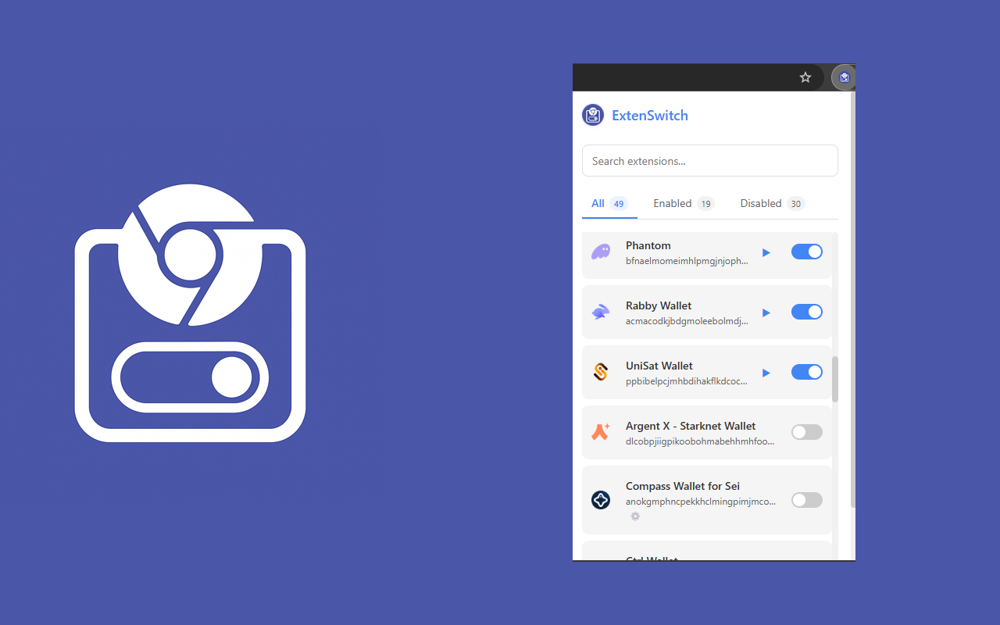
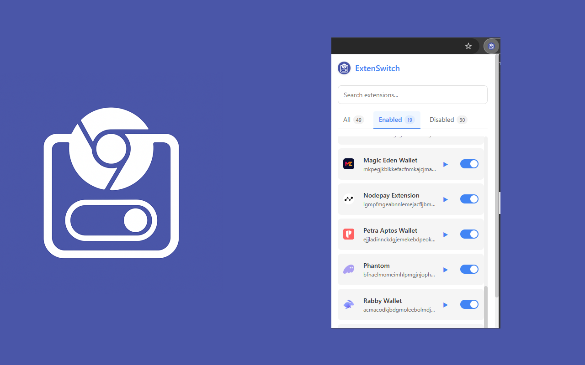

# ExtenSwitch for Chrome

  

Modern extension for easily managing Chrome extensions with just one click. ExtenSwitch provides a clean, intuitive interface to control your browser extensions, perfect for managing crypto wallets and other extensions you want to enable only when needed.

## Features

- **Quick Toggle**: Enable/disable any Chrome extension with a single click
- **Smart Search**: Find extensions instantly by name
- **Convenient Filters**: View all, enabled, or disabled extensions
- **Easy Configuration**: Access extension settings with one click
- **App Launcher**: Launch apps and extensions directly from the manager
- **Clear Labeling**: Deprecated extensions are clearly marked
- **User-Friendly Stats**: See the number of extensions in each category
- **Elegant Design**: Modern and minimalist interface
- **Smart Sorting**: Enabled extensions appear at the top for easy access

## Screenshots

  

  

## Installation

### From Chrome Web Store (Coming Soon)
1. Visit the [Chrome Web Store page](#) (link coming soon)
2. Click "Add to Chrome"
3. Confirm the installation

### From Source
1. Download or clone this repository
2. Open Chrome and go to `chrome://extensions/`
3. Enable "Developer mode" (toggle in the upper right corner)
4. Click the "Load unpacked extension" button
5. Select the folder with this project

## Usage

After installation, you will see the ExtenSwitch icon in the Chrome toolbar. Click on it to open the extension manager.

- **Enable/disable extensions**: Use the toggle to the right of each extension
- **Search for extensions**: Enter the extension name in the search field
- **Filter extensions**: Use the "All", "Enabled", "Disabled" tabs
- **Access extension settings**: Click on the extension name to open its settings
- **Launch extensions**: Click the play button ▶ to launch a Chrome extension or app
- **Identify deprecated extensions**: Clearly marked with a "DEPRECATED" label

## Privacy

ExtenSwitch respects your privacy. The extension operates solely within your browser and does not communicate with external servers.

- No data collection
- No analytics
- No external communication

For more details, please see our [Privacy Policy](https://en.skazoff.com/extenswitch/).

## Development

ExtenSwitch is built with pure JavaScript, HTML, and CSS - no frameworks or external dependencies. This makes the extension extremely lightweight and fast.

### Project Structure
- `manifest.json` - Extension configuration
- `popup.html` - Main interface
- `popup.js` - Core functionality
- `styles.css` - Visual styling
- `background.js` - Background service worker
- `images/` - Icons and promotional images

## Future Plans

- Dark theme toggle for better night-time usage
- Extension grouping functionality for better organization
- Export/import extension configuration
- Hotkeys for quick access to common functions
- Localization for multiple languages

## Credits

Developed by [SkazOff](https://en.skazoff.com/)

## License

This project is licensed under the MIT License - see the [LICENSE](LICENSE) file for details. 